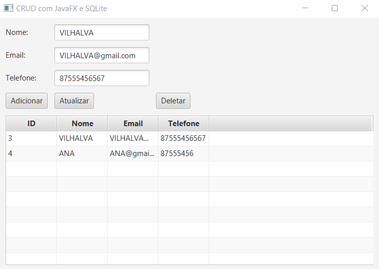
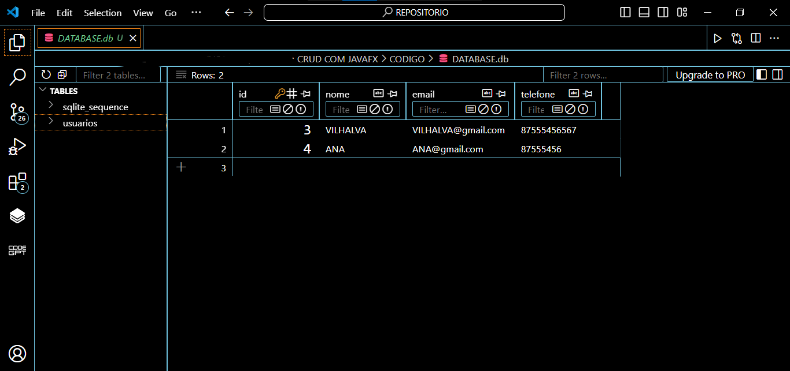

# CRUD COM JAVAFX
👨‍🏫CRUD DE NOME, EMAIL E TELEFONE COM JAVAFX E SQLITE.

 <br>
 <br>

## DESCRIÇÃO:
O aplicativo foi desenvolvido com `JavaFX` e `SQLITE` é um sistema básico de CRUD (Create, Read, Update, Delete) para gerenciar informações de usuários em um banco de dados. Aqui está uma descrição do que ele faz:

1. **Adicionar Usuário:**
   - Permite adicionar novos usuários informando nome, email e telefone.

2. **Atualizar Usuário:**
   - Permite selecionar um usuário na tabela e atualizar suas informações de nome, email e telefone.

3. **Deletar Usuário:**
   - Permite selecionar um usuário na tabela e removê-lo do banco de dados.

4. **Listar Usuários:**
   - Exibe todos os usuários cadastrados em uma tabela, mostrando seu ID, nome, email e telefone.

## EXECUTANDO O PROJETO:
1. **Certifique-se de que o projeto esteja compilado:**
   Antes de executar o projeto, você deve garantir que ele foi compilado corretamente. Navegue até o diretório `./CODIGO`, e use o seguinte comando para compilar:

   ```bash
   mvn clean install
   ```

2. **Executar o projeto:**
   Para executar a aplicação com o Maven, usando a classe principal definida no seu `pom.xml`, use o comando:

   ```bash
   mvn javafx:run
   ```

3. **Interagindo com APP:**
   1. **Interface do Usuário:**
      - Ao iniciar o aplicativo, você verá uma interface com campos para inserir nome, email e telefone de um novo usuário.
      - Abaixo dos campos de entrada, há botões para adicionar, atualizar e deletar usuários, além de uma tabela que exibe todos os usuários cadastrados.

   2. **Adicionar Usuário:**
      - Preencha os campos "Nome", "Email" e "Telefone".
      - Clique no botão "Adicionar" para incluir o novo usuário na tabela e no banco de dados.

   3. **Atualizar Usuário:**
      - Selecione um usuário na tabela clicando na linha correspondente.
      - Edite os campos de "Nome", "Email" e "Telefone".
      - Clique no botão "Atualizar" para salvar as alterações no banco de dados.

   4. **Deletar Usuário:**
      - Selecione um usuário na tabela clicando na linha correspondente.
      - Clique no botão "Deletar" para remover o usuário selecionado do banco de dados.

   5. **Listar Usuários:**
      - A tabela exibe todos os usuários cadastrados, mostrando seu ID, nome, email e telefone.
      - Ela é atualizada automaticamente após adicionar, atualizar ou deletar usuários.
      - Você poderá ver o banco de dados gerado em `./CODIGO/DATABASE.db`.

## TECNOLOGIAS USADAS:
- [LINGUAGEM JAVA:](https://github.com/VILHALVA/CURSO-DE-JAVA) A linguagem de programação Java é amplamente utilizada para o desenvolvimento de aplicativos devido à sua portabilidade, segurança e robustez. Ela é uma escolha popular para desenvolver aplicativos desktop, web e móveis.

- [JAVAFX:](https://github.com/VILHALVA/CURSO-DE-JAVAFX) JavaFX é uma Bíblioteca (plataforma) de desenvolvimento rica para criar aplicações gráficas (GUI) modernas e sofisticadas em Java. Ele é projetado para substituir o Swing como a principal biblioteca para GUIs no Java. JavaFX oferece uma ampla gama de recursos que tornam o desenvolvimento mais intuitivo, flexível e visualmente atraente. 

- [SQLITE:](https://github.com/VILHALVA/CURSO-DE-SQLITE) **SQLite** é um sistema de gerenciamento de banco de dados relacional (RDBMS) que se destaca por ser "self-contained", "serverless", "zero-configuration" e por ocupar um espaço mínimo em disco. Desenvolvido por D. Richard Hipp em 2000, o SQLite foi projetado para ser embutido diretamente em programas em vez de funcionar como um serviço separado, como muitos outros sistemas de banco de dados. 

## CREDITOS:
- [PROJETO BASEADO NO "CRUD COM JAVA SWING"](https://github.com/VILHALVA/CRUD-COM-JAVA-SWING)
- [PROJETO FEITO PELO VILHALVA](https://github.com/VILHALVA)


